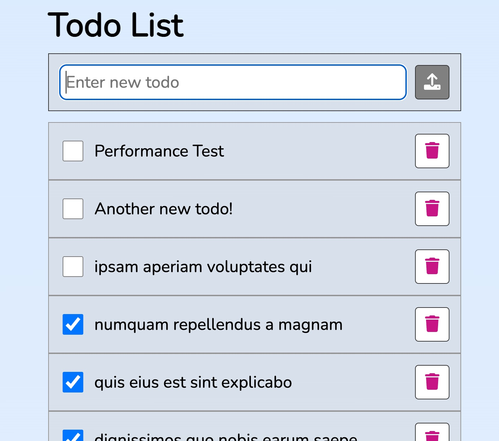

# React Todo App with RTK Query



A simple Todo App created using Create React App, Typescript and RTK Query

## Tech Stack

- Bootstrapped with [`create-react-app`](https://github.com/facebook/create-react-app) v5
- Create React App Override v7.0.0-alpha.0
- [React & React DOM](https://reactjs.org) v18
- Data Fetching and Caching - [RTK Query](https://redux-toolkit.js.org/rtk-query/overview)  (from [Redux Toolkit](https://redux-toolkit.js.org/introduction/getting-started) v1.8.3)
- Icons - [Font Awesome](https://fontawesome.com) v6.1.1
- Type Safety - [TypeScript](https://www.typescriptlang.org) v4.7.4
- Lint - [ESlint](https://nextjs.org/docs/basic-features/eslint) v8, [AirBnB config](https://airbnb.io/javascript) & [Eslint-config-next](https://nextjs.org/docs/basic-features/eslint#eslint-config)
- Format - [Prettier](https://prettier.io) v2.7.1

## Usage

Inside the project directory run using `npm` or `yarn`:

### Start the database

```bash
yarn run start:db
# or
npm run start:db
```

### Run

```bash
yarn start
# or
npm run start
```

Entry point `src/index.tsx`.

## Create React App Override - [CRACO](https://github.com/dilanx/craco)

**C**reate **R**eact **A**pp **C**onfiguration **O**verride is a configuration layer for create-react-app.

It allows all the benefits of create-react-app **and** customization without using 'eject' by adding a single configuration (e.g. `craco.config.js`) file at the root of your application and, in this case, customization of the `.eslintrc` in order to enable the use of Import Path Aliasing.

Craco doesn't support Create React App v5 yet, but there is an open issue about it.

[github.com/gsoft-inc/craco/issues/378](github.com/gsoft-inc/craco/issues/378)

In the meantime, an alpha version (v7.0.0-alpha.0) has been used in this project.

### Current Configuration

### `craco.config.js`

```javascript
...
alias: {
      '@': path.resolve(__dirname, 'src'),
      '@components': path.resolve(__dirname, './src/components/'),
      '@app': path.resolve(__dirname, './src/app/'),
      '@features': path.resolve(__dirname, './src/features/'),
      '@pages': path.resolve(__dirname, './src/pages/'),
      '@counter': path.resolve(__dirname, './src/features/counter')
    }
...
```

### `tsconfig.paths.json`

```javascript
...
"paths": {
    "@/*": [
      "./src/*"
    ],
    "@app/*": [
      "./src/app/*"
    ],
    "@components/*": [
      "./src/components/*"
    ],
    "@features/*": [
      "./src/features/*"
    ],
    "@pages/*": [
      "./src/pages/*"
    ],
    "@counter/*": [
      "./src/features/counter/*"
    ],
  },
...
```

## Available Scripts

In the project directory, you can run:

### `npm start` (from CRACO)

Runs the app in the development mode.\
Open [http://localhost:3000](http://localhost:3000) to view it in the browser.

The page will reload if you make edits.\
You will also see any lint errors in the console.

### `npm test` (from CRACO)

Launches the test runner in the interactive watch mode.\
See the section about [running tests](https://facebook.github.io/create-react-app/docs/running-tests) for more information.

### `npm run build` (from CRACO)

Builds the app for production to the `build` folder.\
It correctly bundles React in production mode and optimizes the build for the best performance.

The build is minified and the filenames include the hashes.\
Your app is ready to be deployed!

See the section about [deployment](https://facebook.github.io/create-react-app/docs/deployment) for more information.

### `npm run eject` (from CRACO)

**Note: this is a one-way operation. Once you `eject`, you can’t go back!**

If you aren’t satisfied with the build tool and configuration choices, you can `eject` at any time. This command will remove the single build dependency from your project.

Instead, it will copy all the configuration files and the transitive dependencies (webpack, Babel, ESLint, etc) right into your project so you have full control over them. All of the commands except `eject` will still work, but they will point to the copied scripts so you can tweak them. At this point you’re on your own.

You don’t have to ever use `eject`. The curated feature set is suitable for small and middle deployments, and you shouldn’t feel obligated to use this feature. However we understand that this tool wouldn’t be useful if you couldn’t customize it when you are ready for it.

## Learn More

You can learn more in the [Create React App documentation](https://facebook.github.io/create-react-app/docs/getting-started).

To learn React, check out the [React documentation](https://reactjs.org/).


